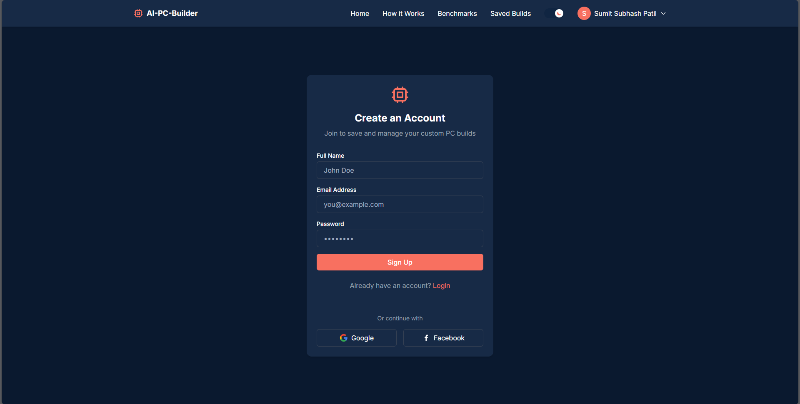

# AI-Powered PC Builder

A full-stack web application that helps users build customized PC configurations based on their requirements, budget, and preferences using AI technology.

## 🚀 Features

- **AI-Generated PC Builds**: Get customized PC configurations based on your needs and budget
- **Component Benchmarks**: Interactive visualizations for comparing PC component performance
- **User Authentication**: Secure login/registration system with JWT authentication
- **Save & Manage Builds**: Save generated builds to your profile for future reference
- **Admin Dashboard**: Admin panel for managing users and system data
- **Responsive Design**: Dark/light mode theme with responsive UI for all devices

## 💻 Tech Stack

### Backend
- **Node.js** with **Express** framework
- **MongoDB** for database with **Mongoose** ODM
- **JWT** for authentication
- **Google AI** for generating PC builds
- **Zod** for schema validation

### Frontend
- **React 19** with **Vite** for fast development
- **React Router** for navigation
- **Tailwind CSS** for styling
- **D3.js** for data visualization
- **Axios** for API requests
- **Context API** for state management

## 📝 Project Structure

```
├── BackEnd/
│   ├── config/           # Database connection and configuration
│   ├── controllers/      # Request handlers
│   ├── middleware/       # Auth middleware and request processing
│   ├── models/           # Database schemas
│   ├── routes/           # API routes
│   ├── utils/            # Utility functions and helpers
│   ├── validation/       # Input validation schemas
│   └── server.js         # Entry point
│
└── FrontEnd/
    ├── public/           # Static assets
    └── src/
        ├── assets/       # Images and resources
        ├── components/   # React components
        ├── context/      # Context providers
        ├── services/     # API service functions
        ├── styles/       # CSS files
        └── App.jsx       # Main application component
```

## 🛠️ Installation and Setup

### Prerequisites
- Node.js (v18 or later)
- MongoDB
- npm or yarn

### Backend Setup
1. Navigate to the backend directory:
   ```bash
   cd BackEnd
   ```

2. Install dependencies:
   ```bash
   npm install
   ```

3. Create a `.env` file in the BackEnd directory with the following variables:
   ```
   PORT=11822
   MONGODB_URI=your_mongodb_connection_string
   JWT_SECRET=your_jwt_secret_key
   GOOGLE_API_KEY=your_google_ai_api_key
   NODE_ENV=development
   ```

   **Important Note about Environment Variables:**
   - The `.env` file contains sensitive information and is excluded from version control via `.gitignore`
   - Each developer must create their own `.env` file locally
   - For production deployment, set these environment variables on your hosting platform
   - Generate a strong random string for `JWT_SECRET` (recommended 32+ characters)
   - Get a MongoDB connection string from your MongoDB Atlas account or local MongoDB installation
   - Obtain a Google AI API key from the Google Cloud Platform

4. Start the development server:
   ```bash
   npm run dev
   ```

### Frontend Setup
1. Navigate to the frontend directory:
   ```bash
   cd FrontEnd
   ```

2. Install dependencies:
   ```bash
   npm install
   ```

3. Create a `.env` file in the FrontEnd directory with the following variables:
   ```
   VITE_API_URL=http://localhost:11822
   VITE_ENV=development
   ```

   **Note:** Any environment variables for the Vite frontend must be prefixed with `VITE_` to be accessible in the application.

4. Start the development server:
   ```bash
   npm run dev
   ```

5. Open your browser and navigate to `http://localhost:5173`

## � Security and Environment Configuration

This project follows security best practices for managing sensitive information:

### Environment Variables
- **Never commit `.env` files to the repository**
- All sensitive credentials are stored in environment variables
- The `.gitignore` file is configured to exclude sensitive files and directories

### Setting Up Environment Variables
1. **Backend (.env file in BackEnd/ directory)**
   ```
   PORT=11822                              # Port for the server to run on
   MONGODB_URI=mongodb://...               # Your MongoDB connection string
   JWT_SECRET=your_very_strong_secret_key  # Secret for signing JWT tokens
   GOOGLE_API_KEY=your_api_key             # API key for Google AI services
   NODE_ENV=development                    # Environment (development/production)
   ```

2. **Frontend (.env file in FrontEnd/ directory)**
   ```
   VITE_API_URL=http://localhost:11822     # Backend API URL
   VITE_ENV=development                    # Environment (development/production)
   ```

### Secret Generation
For generating secure random strings for JWT_SECRET:
```bash
node -e "console.log(require('crypto').randomBytes(32).toString('hex'))"
```

## �📊 Key Features Explained

### AI-Powered Build Generation
The system uses Google's Generative AI to create optimized PC builds based on user requirements, budget constraints, and preferences. The AI considers component compatibility, performance benchmarks, and value for money.

### Benchmark Visualization
The application provides interactive visualizations for component benchmarks, including:
- Bar charts for direct performance comparisons
- Line charts for historical performance trends
- Scatter plots for price-to-performance analysis

### User Authentication System
Secure authentication system with:
- JWT-based authentication
- Password hashing with bcrypt
- Role-based access control (user/admin)
- Protected routes for authenticated users

## 🌐 API Endpoints

### Authentication
- `POST /register` - Register a new user
- `POST /login` - User login

### PC Builds
- `POST /generateBuild` - Generate a new PC build using AI
- `GET /builds` - Get saved builds for a user
- `POST /builds` - Save a new build
- `GET /builds/:id` - Get details of a specific build
- `DELETE /builds/:id` - Delete a saved build

### Benchmarks
- `GET /benchmarks` - Get component benchmarks
- `GET /benchmarks/types` - Get available component types
- `GET /benchmarks/brands/:type` - Get brands for a specific component type

### User Management
- `GET /users/profile` - Get current user profile
- `PUT /users/profile` - Update user profile
- `DELETE /users/:id` - Delete user account

### Admin
- `GET /admin/users` - Get all users
- `PUT /admin/users/:id` - Update user details
- `GET /admin/stats` - Get system statistics

## 🖥️ Screenshots

### SignUp Page


### Login Page


### Landing Page

(./screenshots/2.PNG)

### About Page


### BenchMarks Page

(./screenshots/5.PNG)
(./screenshots/6.PNG)

### Saved Build Page


### User Page


### Build Result Page

(./screenshots/12.PNG)
(./screenshots/13.PNG)
(./screenshots/14.PNG)

## 🤝 Contributing

1. Fork the repository
2. Create your feature branch (`git checkout -b feature/amazing-feature`)
3. Commit your changes (`git commit -m 'Add some amazing feature'`)
4. Push to the branch (`git push origin feature/amazing-feature`)
5. Open a Pull Request

## 📄 License

This project is licensed under the MIT License - see the LICENSE file for details.

## 👥 Contributors

- [Sumit4689](https://github.com/Sumit4689) - Project lead

## 🙏 Acknowledgements

- [D3.js](https://d3js.org/)
- [React](https://reactjs.org/)
- [MongoDB](https://www.mongodb.com/)
- [Express](https://expressjs.com/)
- [Tailwind CSS](https://tailwindcss.com/)
- [Google Generative AI](https://ai.google.dev/)
